# 🎯 Sidekick

<div align="center">
    
**Your AI-powered Zoom companion that transforms meeting conversations into instant automated actions**

[](https://www.python.org/)
[](https://langchain-ai.github.io/langgraph/)
[](https://www.anthropic.com/)
[](https://groq.com/)
[](https://streamlit.io/)

*"The world's first Zoom bot that can transcribe audio in real-time and turn conversations into action"*

</div>

---

##  What is Sidekick?

**Sidekick** joins your Zoom meetings invisibly, listens in real-time, and **automatically executes** the action items discussed—all while you focus on what matters most. No more forgotten tasks, missed follow-ups, or scattered notes.

> *"Schedule a follow-up with the design team tomorrow at 2pm"* → ✅ **Calendar invite sent**  
> *"Add Nikhil as a reviewer on the auth PR"* → ✅ **GitHub reviewer assigned**  
> *"Send the meeting notes to the engineering channel"* → ✅ **Slack message posted**

###  The Problem We Solve

In our years working across industry giants (Qualcomm, Samsara, Nutanix) and startups, we've seen the same pattern: **great meetings that lose their momentum the moment you leave the Zoom call**. Action items get forgotten, follow-ups slip through cracks, and progress stalls.

**Sidekick changes that.**

---

##  Features

### 🎤 **Real-Time Audio Intelligence**
- **Sub-100ms latency** transcription using Groq's Whisper v3
- **Voice Activity Detection** to filter noise and silence
- **Streaming PCM audio** directly from Zoom WebSocket
- **Context-aware** conversation understanding

### 🤖 **Autonomous Agent Orchestra**
- **LangGraph-powered** multi-agent system
- **Claude 4** for natural language intent extraction
- **MCP (Model Control Protocol)** for seamless integrations
- **Human-in-the-loop** approval workflow

### 🎨 **Beautiful User Experience**
- **Conversation-style** action previews
- **Real-time** command parsing and execution
- **Smart notifications** with impact explanations
- **One-click approval** system

### 🔗 **Enterprise Integrations**
| Platform | Capabilities | Status |
|----------|-------------|---------|
| **GitHub** | PR reviews, issue creation, assignee management | ✅ Active |
| **Outlook Calendar** | Meeting scheduling, availability checking, invites | ✅ Active |
| **Notion** | Document creation, task management, sharing | 🚧 In Progress |

---

## 🚀 Quick Start

### Prerequisites
- Python 3.11+
- WhisperLive server running on `localhost:9090`
- Valid API keys for integrations

### Environment Setup

```bash
# Required API Keys
ANTHROPIC_API_KEY=your_claude_api_key
GITHUB_TOKEN=your_github_token
MICROSOFT_CLIENT_ID=your_outlook_client_id
MICROSOFT_CLIENT_SECRET=your_outlook_client_secret
SLACK_BOT_TOKEN=your_slack_bot_token

# Optional Configuration
MODEL_NAME=claude-3-5-sonnet-20241022
GITHUB_REPOSITORY=your-org/your-repo
```

---

## 🏗️ Architecture

### 🎯 **Core Pipeline**

```mermaid
graph TD
    A[🎤 Zoom Audio Stream] --> B[📡 WhisperLive + Groq]
    B --> C[🧠 Command Extractor]
    C --> D[🎭 Supervisor Agent]
    D --> E[⚡ Worker Agents]
    E --> F[🔧 MCP Tools]
    F --> G[✅ User Approval]
    G --> H[🚀 Action Execution]
    H --> I[📊 Result Tracking]
```



### 🧠 **Agent System**

**Sidekick uses a sophisticated multi-agent architecture built on LangGraph:**

####  Supervisor Agent
- **Intent Classification**: Parses natural language into actionable commands
- **Context Management**: Maintains conversation history and speaker identification
- **Agent Routing**: Intelligently routes commands to specialized workers

####  Worker Agents
Each integration has a dedicated agent with specialized tools:

```python
# Example: GitHub Agent
class GitHubAgent(AgentRunnable):
    tools = [
        "add_reviewer_to_pr",      # Add code reviewers
        "create_github_issue",     # Create tracked issues
        "assign_task",             # Assign work to team members
        "merge_branch"             # Handle deployment workflows
    ]
```

#### 🔧 Tool Execution
- **MCP Protocol**: Standardized tool calling across platforms
- **Error Handling**: Robust retry and fallback mechanisms
- **Rate Limiting**: Respectful API usage patterns

### 📊 **State Management**

```python
class AgentState(TypedDict):
    messages: List[BaseMessage]     # Conversation history
    transcript: List[str]           # Real-time audio buffer
    next: str                       # Routing decisions
```

---


### 📊 **Agent Graph Visualization**

The system automatically generates a visual representation of the agent workflow:


---

## 📚 Resources

- [**📖 Devpost**](https://devpost.com/software/sidekick-y74bw6?ref_content=my-projects-tab&ref_feature=my_projects)
- [**🎥 Demo Video**](https://youtu.be/qO8s4H-Ad8Q)
  
---

## 👥 Made By

<div align="center">

<table>
<tr>
<td align="center" width="50%">
<br />
<h3><strong>Yash Gupta</strong></h3>
<br/>
<a href="https://www.linkedin.com/in/yashsgupta/">

</a>
<br/>
<a href="https://x.com/yash_s_gupta">

</a>
</td>
<td align="center" width="50%">
<br />
<h3><strong>Nikhil Sethuram</strong></h3>
<br/>
<a href="https://www.linkedin.com/in/nikhilsethuram/">

</a>
<br/>
</td>
</tr>
</table>

---
